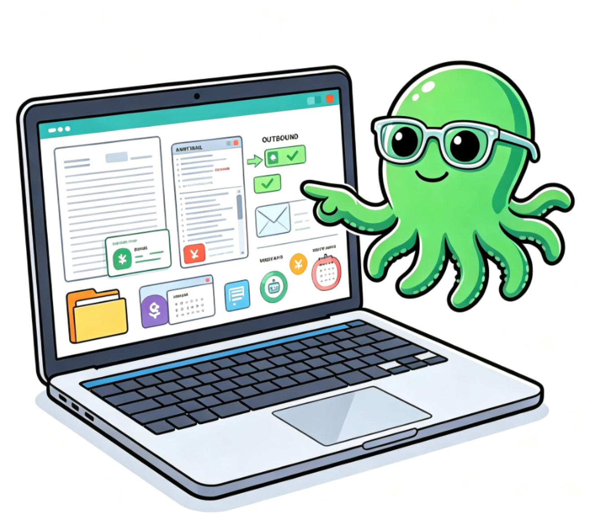
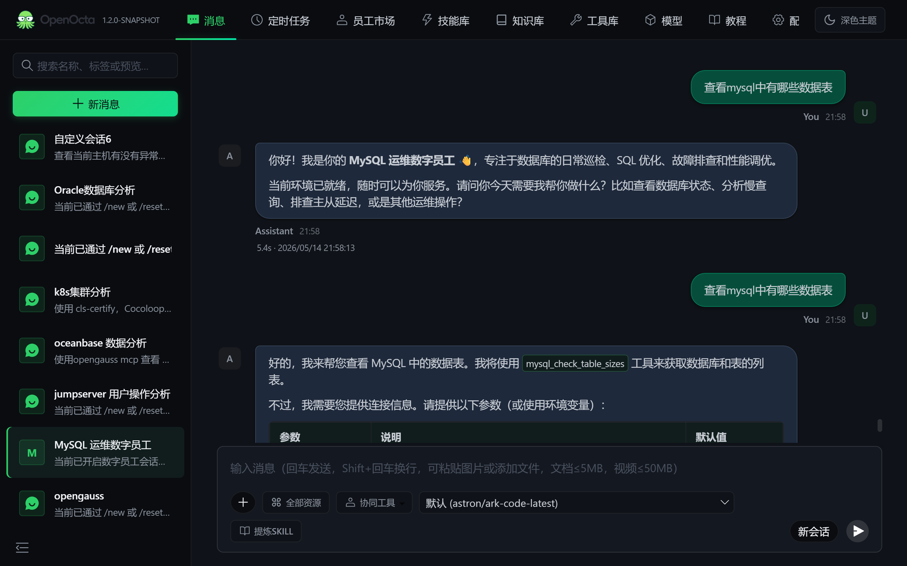
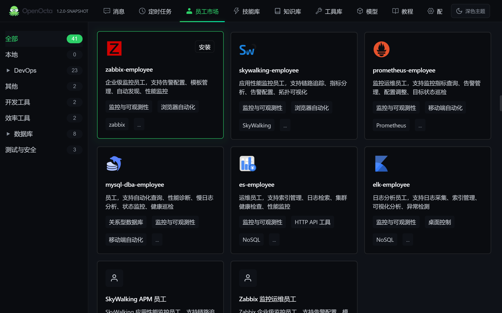
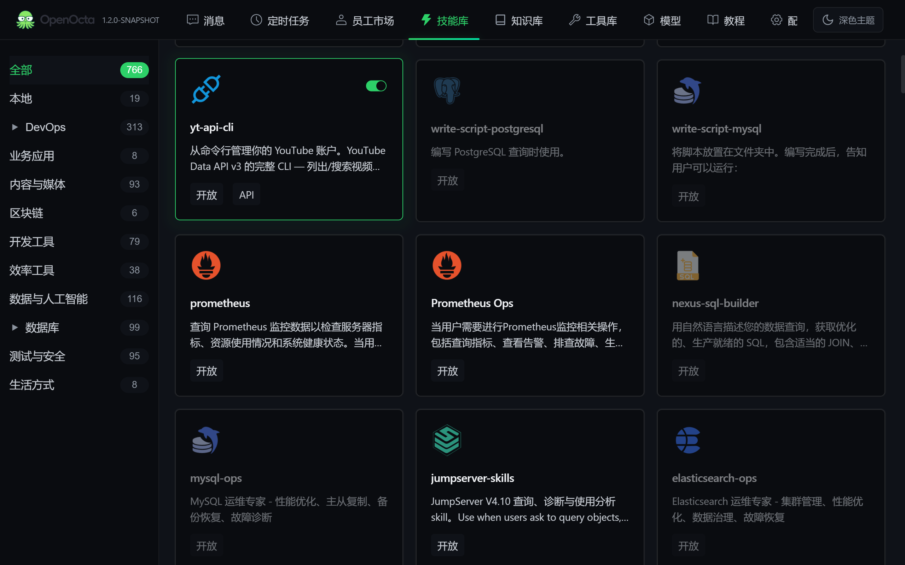
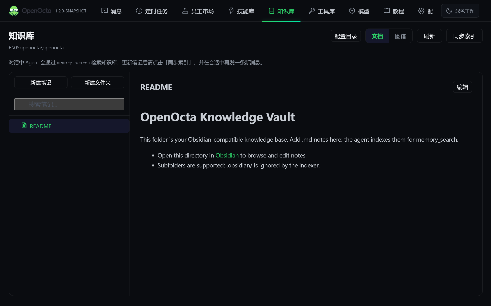
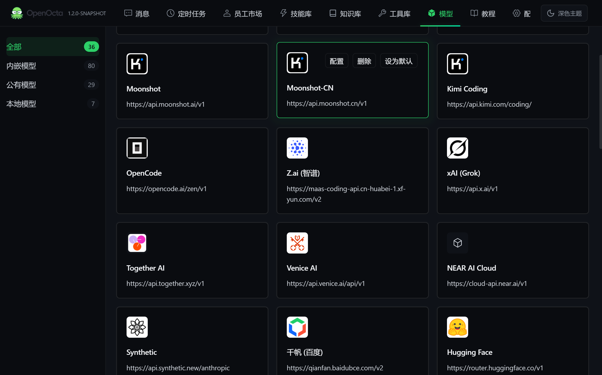
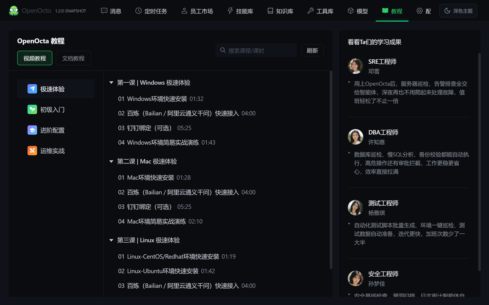
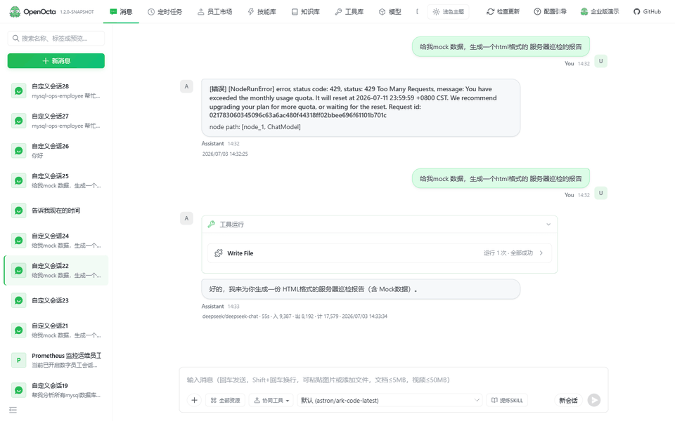
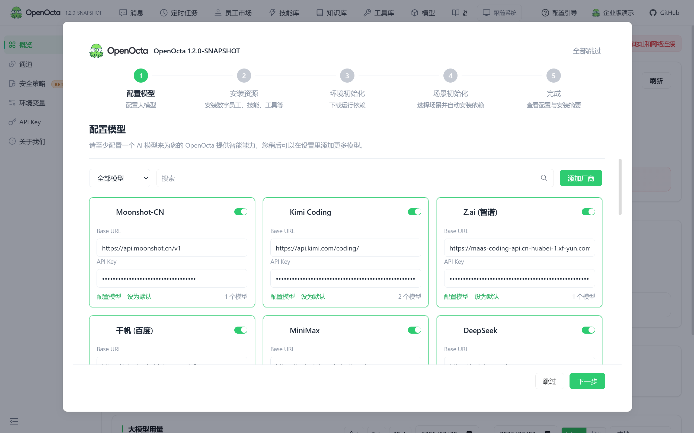

<p align="center">
  
</p>

<p align="center">
  <a href="https://github.com/openocta/openocta/stargazers">
    
  </a>
  <a href="https://github.com/openocta/openocta/forks">
    
  </a>
  <a href="https://github.com/openocta/openocta/releases/latest">
    
  </a>
  
</p>

<p align="center">
  <b>OpenOcta</b> — <b>An Open-Source Personal Desktop AI Agent</b>
</p>


<p align="center">
  <a href="https://openocta.com">Website</a> ·
  <a href="README.cn.md">简体中文</a>
</p>
<p align="center">
  <sub>Double-click install · run locally · instant boot · your data stays on your machine</sub>
</p>

**OpenOcta** is an open-source personal desktop AI agent，open-source work mate. Double-click to install on your PC — an Agent that runs on your own machine under your full control. Use natural language for office work, IT ops, marketing, business analysis, and software testing.

**Latest [v1.0.5](https://github.com/openocta/openocta/releases/tag/v1.0.5)** (2026-07-02) — all-platform installers · fix for tool-call chat history · single Go binary with embedded Control UI

[All releases →](https://github.com/openocta/openocta/releases)

---

## ✨ Features

🖥️ **Personal desktop** — built for your PC: files, terminal, browser, and local projects — not just a chat window.

⚡️ **Double-click ready** — install in ~30 seconds with a full Control UI out of the box — no hours of CLI setup.

🪶 **Ultra-lightweight** — ~30MB installers and low runtime memory — ideal for 24/7 background use.

🔒 **Local-first** — sessions and memory stay on your machine; data stays under your control and can run on intranet — no Node / Python in production.

🔧 **Fully self-developed Go** — Gateway, Agent, and Channels are native Go — single binary with embedded Control UI.

🔌 **Skills & MCP** — built-in tools + MCP protocol + [skills marketplace](https://resource.openocta.com) — extend digital employee capabilities on demand.

💬 **IM remote control** — drive tasks from WeChat, WeCom, DingTalk, and Feishu anytime, anywhere.

🧠 **Four-tier memory + L4 evolution** — Knowledge Vault learns your preferences over time ([docs](./docs/knowledge-vault.md)).

 **Open source from China** — maintained by a Chinese team, 100%  Apache-2.0 — China's first open-source personal desktop AI agent.

---

## vs. OpenClaw & Hermes

OpenOcta is **personal desktop-first**: double-click install, full client UI, domestic IM, and CN LLM integrations. Versus OpenClaw (Node self-host) and Hermes (Python CLI), OpenOcta ships a **fully self-developed Go runtime** as a **single binary**, with **L4 evolution** and **Knowledge Vault**.

| | OpenOcta | OpenClaw | Hermes |
|---|:---:|:---:|:---:|
| Onboarding | Double-click install | CLI deploy | CLI deploy |
| Runtime | Go · single binary | Node.js | Python |
| Localization | CN IM + CN LLMs | Global IM/models | Global IM/models |
| Memory evolution | Four-tier + L4 Evolution | Workspace Markdown | Skill self-gen |
| Local knowledge base | Knowledge Vault | — | — |
| Install time | ~30 seconds | Hours of setup typical | Hours of setup typical |

**Full comparison & selection guide** → [docs/compare-openclaw-hermes.en.md](./docs/compare-openclaw-hermes.en.md)

---

## Product UI

A quick look at the OpenOcta desktop client:

<table>
<tr>
<td width="50%" align="center" valign="top">
<br/>
<sub><b>Agent chat</b> · multi-turn collaboration, tool use, and complex tasks driven by natural language</sub>
</td>
<td width="50%" align="center" valign="top">
<br/>
<sub><b>Employee market</b> · one-click install Zabbix, Prometheus, MySQL DBA, and more digital employees</sub>
</td>
</tr>
<tr>
<td width="50%" align="center" valign="top">
<br/>
<sub><b>Skills library</b> · 766+ Skills across DevOps / databases / dev tools</sub>
</td>
<td width="50%" align="center" valign="top">
<br/>
<sub><b>Knowledge vault</b> · Obsidian-compatible notes, synced index for Agent semantic search</sub>
</td>
</tr>
<tr>
<td width="50%" align="center" valign="top">
<br/>
<sub><b>Models</b> · public and local model providers supported</sub>
</td>
<td width="50%" align="center" valign="top">
<br/>
<sub><b>Tutorials</b> · video and doc courses for Windows / Mac / Linux quick start and ops practice</sub>
</td>
</tr>
</table>

The client also includes **Tools**, **Scheduled tasks**, and **IM channels**. Download at [openocta.com](https://openocta.com).

---

## Use cases

**Office work** — automate repetitive tasks and free up creativity.  
*e.g. “Summarize this week’s emails and draft a status report”*

**IT ops** — 24/7 intelligent on-call, from firefighting to prevention.  
*e.g. “Analyze this alert log and suggest remediation”*

**Marketing** — produce multi-channel content faster.  
*e.g. “Write a short social post from this product brief”*

**Knowledge management** — local knowledge base with semantic search.  
*e.g. “Find XX policy in my vault and summarize it”*

**Dev collaboration** — read code, edit repos, run commands, wire toolchains.  
*e.g. “Read this repo’s README and list items to fix”*

More at [openocta.com/cases](https://openocta.com/cases) and [docs/scenarios.md](./docs/scenarios.md).

---

## Launch in 30 seconds

1. **Download** — [GitHub Releases](https://github.com/openocta/openocta/releases/latest) or [openocta.com](https://openocta.com/#download)
2. **Install & open** — desktop client, ready in ~30 seconds
3. **Chat** — describe a task in **Chat**; the agent uses files, terminal, and tools

<p align="center">
  
  <br/>
  <sub>Product demo · chat → skills → knowledge → ops agent (pending)</sub>
</p>

---

## First-time setup (~2 min)

Connect a model before your first chat:

**Option A — UI (recommended)**  
Open the **Models** tab or follow the **setup wizard** on first launch, then enter your API key and choose a model.

<p align="center">
  
</p>

**Option B — Config file**

| Platform | Config path |
|----------|-------------|
| Linux / macOS | `~/.openocta/openocta.json` |
| Windows | `%APPDATA%\openocta\openocta.json` |

Minimal example ([Moonshot CN](https://platform.moonshot.cn/); see [model providers](./docs/model-providers.md) for DeepSeek, Qwen, etc.):

```json
{
  "env": {
    "vars": {
      "MOONSHOT_API_KEY": "sk-your-key"
    }
  },
  "agents": {
    "defaults": {
      "model": { "primary": "moonshot-cn/kimi-k2.5" }
    }
  }
}
```

Restart the client, then try in **Chat**:

> List files in the current working directory and tell me the 3 largest

---

## Why OpenOcta

| | |
|---|---|
| **Personal desktop** | Built for your PC — files, terminal, browser, and local projects, not just a chat box |
| **Self-developed Go runtime** | Gateway, Agent, Channels fully built in Go; **single binary**, no Node/Python in production |
| **China's first open source** | Maintained by a Chinese team; 100%  Apache-2.0 — auditable, forkable, intranet-deployable |
| **IM remote control** | Drive tasks from WeChat, WeCom, DingTalk, Feishu, and more |
| **Lightweight** | ~30MB installers, low memory footprint for 24/7 use |
| **Skills & MCP** | Built-in tools, MCP servers, and a marketplace for digital employees |
| **Four-tier memory + L4 evolution** | **Knowledge Vault** and **L4 Evolution** for self-curated memory ([docs](./docs/knowledge-vault.md)) |

> OpenOcta takes design cues from [OpenClaw](https://github.com/openclaw/openclaw) Gateway protocol and Control UI, and is **fully reimplemented in Go**.

---

## Download & install

Visit **[openocta.com/download](https://openocta.com/#download)**:

| Platform | Package |
|----------|---------|
| Windows | `OpenOcta-amd64-installer.exe` |
| macOS (Apple Silicon) | `OpenOcta-arm64.dmg` |
| macOS (Intel) | `OpenOcta-amd64.dmg` |
| Linux | `.deb` / `.rpm` / `.tar.gz` (amd64 / arm64) |

Config is initialized on first run:

| Platform | Default config path |
|----------|---------------------|
| Linux / macOS | `~/.openocta/openocta.json` |
| Windows | `%APPDATA%\openocta\openocta.json` |

On macOS, install from the `.dmg` into Applications — see [`deploy/dist-README.md`](./deploy/dist-README.md).

**Links**

- **Website**: https://openocta.com
- **Quick start**: platform guides on the download page
- **Skills / MCP marketplace**: https://resource.openocta.com
- **Enterprise (AMC)**: https://amc.openocta.com

---

## Build from source (developers)

For self-hosting Gateway and Control UI (end users can use the installers above without building).

### Requirements

- **Go 1.24+**
- **Node ≥18** (frontend build only — **not required in production**)
- **`ANTHROPIC_API_KEY`** (for `agent` CLI)

### Build and run

```bash
make build
./openocta gateway run
```

Gateway listens on `http://127.0.0.1:18900` by default. The Control UI is **embedded via go:embed** — open that URL in a browser.

### Dev mode (frontend HMR)

```bash
./openocta gateway run    # terminal 1
make run-ui               # terminal 2 → http://localhost:5173
```

### Agent CLI

```bash
export ANTHROPIC_API_KEY=your-key
./openocta agent -m "Hello, echo test"
```

---

## Documentation

| Doc | Description |
|-----|-------------|
| [architecture.md](./docs/architecture.md) | Layered design |
| [configuration.md](./docs/configuration.md) | Config reference |
| [channels-overview.md](./docs/channels-overview.md) | Messaging channels |
| [mcp-configuration.md](./docs/mcp-configuration.md) | MCP setup |
| [skills.md](./docs/skills.md) | Skills system |
| [tools.md](./docs/tools.md) | Built-in tools |
| [digital-employees.md](./docs/digital-employees.md) | Digital employees |
| [webhooks.md](./docs/webhooks.md) | Webhook endpoints |
| [compare-openclaw-hermes.en.md](./docs/compare-openclaw-hermes.en.md) | Full comparison |
| [src/README.md](./src/README.md) | Backend |
| [ui/README.md](./ui/README.md) | Control UI |

### 简体中文

- [README.md](./README.md)

Upstream: [OpenClaw](https://github.com/openclaw/openclaw) · [docs.openclaw.ai](https://docs.openclaw.ai)

---

## Project layout

```text
OpenOcta/
├── src/          # Go backend
├── ui/           # Control UI
├── deploy/       # Installers, Docker, systemd
├── docs/         # Documentation
└── imgs/         # Logo, screenshots, community QR
    ├── readmePIC/    # README feature screenshots
    └── screenshots/  # Demo GIF and UI screenshots
```

---

## Community

- **Star the repo**: [⭐ Star](https://github.com/openocta/openocta/stargazers) and Watch for updates
- **Good first issues**: [Issues for newcomers](https://github.com/openocta/openocta/issues?q=is%3Aissue+is%3Aopen+label%3A%22good+first+issue%22)
- **Contribute**: [CONTRIBUTING.md](./CONTRIBUTING.md) — Pull Requests welcome
- **Issues**: [GitHub Issues](https://github.com/openocta/openocta/issues)
- **Community chat**: scan the QR code below or visit [openocta.com](https://openocta.com)

<p align="center">
  
  <br/>
  <sub>Scan to join the OpenOcta community group</sub>
</p>

---

## License

This project is licensed under ** Apache-2.0**.
