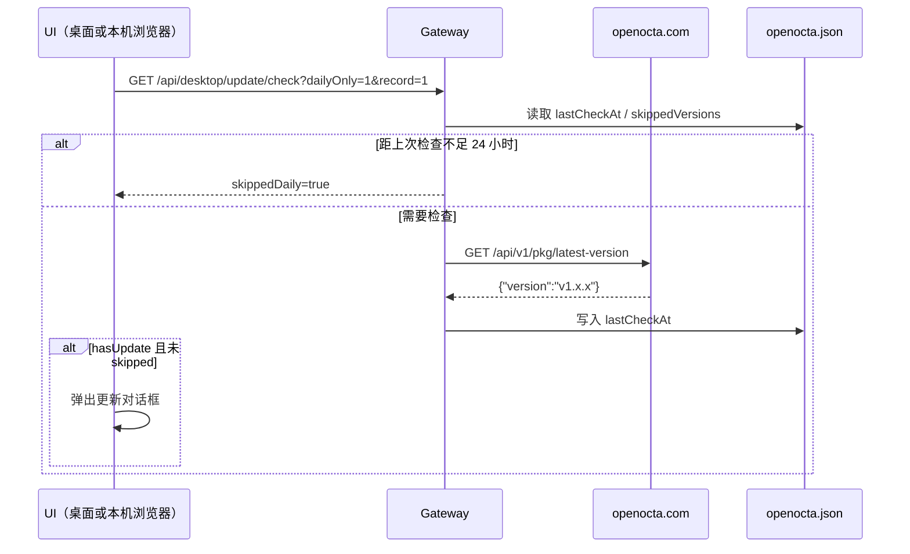

# OpenOcta 应用自动更新

本文档说明 OpenOcta **桌面应用（Wails）** 与 **Linux 服务端（systemd）** 共用的版本检查、跳过记录与安装能力。桌面端与服务端使用同一套 Gateway API 与 UI 交互，差异仅在安装方式（dmg/exe vs deb/rpm）。

---

## 一、功能概述

| 能力 | 说明 |
|------|------|
| **每日自动检查** | 连接本机 Gateway 后，若距上次检查已超过 24 小时，则请求平台最新版本；有新版本且未被跳过时弹出更新对话框 |
| **手动检查** | 顶部栏「检查更新」按钮（位于「配置引导」左侧）；已是最新则提示，有更新则弹框（**不受跳过记录影响**） |
| **跳过版本** | 「跳过此版本」写入 `openocta.json` 的 `update.skippedVersions`；后续自动检查不再提示 |
| **自动安装（方案 A）** | 支持的平台一键下载并安装（deb/rpm/dmg/exe） |
| **手动安装（方案 C）** | 自动安装失败或无 sudo 权限时，对话框展示 deb/rpm/tar.gz 命令，支持复制与打开下载链接 |

### UI 显示条件

「检查更新」在以下情况可用（逻辑一致）：

- Wails 桌面壳（`OPENOCTA_RUN_MODE=desktop`）
- 浏览器访问 **本机** Gateway（`127.0.0.1` / `localhost` / 与页面同 hostname）

连接远程服务器 IP 时不显示该按钮（避免误在客户端触发服务端安装）。

### 自动安装允许条件

| 运行模式 | 平台 | 自动安装 |
|----------|------|----------|
| `desktop` | macOS / Windows | 支持 |
| `service` | Linux | 支持 deb/rpm（需 `sudo -n` 无密码） |
| 其他 | — | 仅检查 + 手动命令 |

### 安装包与下载地址

完整列表见 [docs/download_url.txt](./download_url.txt)：

| 平台 | 架构 | 自动安装 | 下载包 |
|------|------|----------|--------|
| macOS | arm64 | dmg | `OpenOcta-arm64.dmg` |
| macOS | amd64 | dmg | `OpenOcta-amd64.dmg` |
| Windows | amd64 | exe (`/S`) | `OpenOcta-amd64-installer.exe` |
| Linux | amd64 | deb 或 rpm | `openocta_linux_amd64.deb` / `.rpm` |
| Linux | arm64 | deb 或 rpm | `openocta_linux_arm64.deb` / `.rpm` |
| Linux | amd64/arm64 | 手动 | `.tar.gz`（对话框内命令） |

Linux 自动安装包类型按环境检测：已安装 deb/rpm 包 → 同类型升级；否则 Debian 系优先 deb，RHEL 系优先 rpm。

---

## 二、用户操作流程

### 2.1 自动检查（每日）



对话框选项：

| 按钮 | 行为 |
|------|------|
| **立即更新** | 自动下载安装（`autoInstallSupported=true` 时） |
| **复制命令** | 复制 deb/rpm/tar.gz 手动安装命令 |
| **打开下载** | 打开主下载链接（无自动安装时） |
| **跳过此版本** | 写入 `update.skippedVersions` |
| **稍后** | 关闭，不写跳过记录 |

### 2.2 安装流程

**macOS（dmg）**：下载 → 挂载 → 复制到 `/Applications` → 重启应用

**Windows（exe）**：下载 → NSIS 静默安装 `/S` → 退出应用

**Linux（deb/rpm，方案 A）**：

1. 下载对应 `.deb` 或 `.rpm`
2. `sudo systemctl stop openocta`
3. `sudo dpkg -i` 或 `sudo rpm -Uvh`（使用 `sudo -n`，需已配置免密 sudo）
4. `sudo systemctl start openocta`，当前进程退出

**Linux（方案 C，自动失败或无 sudo）**：对话框展示完整命令，例如：

```bash
curl -fLO https://openocta.com/pkg/openocta_linux_amd64.deb
sudo systemctl stop openocta
sudo dpkg -i openocta_linux_amd64.deb
sudo systemctl start openocta
```

安装进度：`GET /api/desktop/update/status`（前端约每 1.5 秒轮询）。

---

## 三、配置（openocta.json）

```json
{
  "update": {
    "skippedVersions": ["v1.0.0"],
    "lastCheckAt": "2026-07-04T02:00:00Z"
  }
}
```

| 字段 | 说明 |
|------|------|
| `skippedVersions` | 自动检查忽略的版本号 |
| `lastCheckAt` | 上次检查时间（RFC3339），24 小时间隔 |

路径：`~/.openocta/openocta.json`（Windows 为 `%APPDATA%\openocta\openocta.json`）。详见 [配置说明](./configuration.md)。

---

## 四、Gateway HTTP API

基址默认 `http://127.0.0.1:18900`，需 Gateway Token。

### 4.1 检查更新

```http
GET /api/desktop/update/check?force=0&record=1&dailyOnly=0
```

响应字段（节选）：

```json
{
  "ok": true,
  "currentVersion": "v1.0.0",
  "latestVersion": "v1.1.0",
  "hasUpdate": true,
  "skipped": false,
  "downloadSupported": true,
  "downloadUrl": "https://openocta.com/pkg/openocta_linux_amd64.deb",
  "autoInstallSupported": true,
  "installAllowed": true,
  "packageFormat": "deb",
  "downloadUrls": {
    "deb": "https://openocta.com/pkg/openocta_linux_amd64.deb",
    "rpm": "https://openocta.com/pkg/openocta_linux_amd64.rpm",
    "tar.gz": "https://openocta.com/pkg/openocta_linux_amd64.tar.gz"
  },
  "manualInstallHint": "若自动安装失败…",
  "desktopMode": false
}
```

### 4.2 跳过 / 安装 / 状态

- `POST /api/desktop/update/skip` — body: `{"version":"v1.1.0"}`
- `POST /api/desktop/update/install` — 需 `installAllowed`（desktop 或 Linux service）
- `GET /api/desktop/update/status` — 含 `manualInstallHint`（安装失败时）

WebSocket `update.run` 与 HTTP 安装共用 `pkg/appupdate` 逻辑。

---

## 五、代码结构

| 路径 | 职责 |
|------|------|
| `src/pkg/appupdate/urls.go` | 各平台下载 URL、`ResolvePlatformTarget` |
| `src/pkg/appupdate/install_linux.go` | deb/rpm + systemd |
| `src/pkg/appupdate/manual_hint.go` | Linux 手动安装命令 |
| `ui/src/ui/app-update.ts` | 检查逻辑；`isAppUpdateUIAvailable` |
| `ui/src/ui/views/app-update-modal.ts` | 统一更新对话框 |

---

## 六、测试与发版

- [ ] `download_url.txt` 全部 URL 可下载且版本正确
- [ ] macOS / Windows 桌面：自动安装 + 重启
- [ ] Linux deb/rpm：`sudo -n` 环境下自动升级；无 sudo 时手动命令可用
- [ ] 本机浏览器访问 Linux Gateway：检查更新可用；远程 IP 不可用
- [ ] 跳过版本与 24 小时 daily 逻辑

---

## 七、常见问题

**Q: Linux 自动安装提示需要 sudo 密码？**

网关进程通常以 systemd 运行，自动安装使用 `sudo -n`（非交互）。请配置 sudoers 免密，或使用对话框中的手动命令。

**Q: tar.gz 能否自动安装？**

当前仅提供手动命令（方案 C）；自动安装仅 deb/rpm（方案 A）。

**Q: 为什么远程服务器上看不到「检查更新」？**

仅本机 Gateway 显示该入口，防止在运维笔记本上误触发服务器升级。

---

## 相关文档

- [配置说明](./configuration.md)
- [桌面应用设计](./desktop-app-design.md)
- [发版 Checklist](./release-checklist.md)
- [安装包 URL](./download_url.txt)
