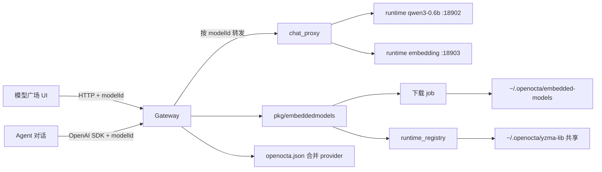

# OpenOcta 内嵌模型（Embedded Models）

本文档说明 OpenOcta **内嵌模型**功能：在本地通过 [yzma](https://github.com/hybridgroup/yzma) + llama.cpp 运行 GGUF 权重，无需依赖 Ollama 等外部服务。模型按用途分为 **Chat 对话模型** 与 **Embedding 向量模型** 两类。

---

## 一、功能概述

| 能力 | 说明 |
|------|------|
| **模型广场** | 顶栏「模型」→ 侧栏「内嵌模型」，浏览、下载内置与扩展 GGUF 模型 |
| **类型区分** | **Chat**：生成式对话，供 Agent 使用；**Embedding**：文本向量化，供检索/知识库使用 |
| **本地下载** | 权重保存至 `~/.openocta/embedded-models/`，带进度条与取消 |
| **本地推理** | 每个运行中的模型在 `127.0.0.1:18902+` 独立监听；Agent 经 Gateway 代理按 `modelId` 路由 |
| **多模型并行** | 可同时启动多个 Chat / Embedding 实例（共享 yzma 推理库，各自占用模型内存） |
| **自动注册** | 启动/停止后合并写入 `openocta.json` 的 `models.providers`（经 Gateway 统一代理） |

### 模型类型对照

| 类型 | `kind` 字段 | 用途 | 本地 API | 配置 Provider ID |
|------|-------------|------|----------|------------------|
| **Chat 对话** | `chat` | Agent 对话、工具调用、多模态识图（VLM） | `POST /v1/chat/completions` | `openocta-embedded-chat` |
| **Embedding 向量** | `embedding` | 知识库索引、语义搜索、聚类 | `POST /v1/embeddings` | `openocta-embedded-embedding` |

> **性能提示**：内嵌模型会在有模型运行时显示横幅——同时运行多个模型会显著占用内存并降低推理速度，建议按需启动、用完即停。Chat 与 Embedding 也可以并行运行（例如一边对话一边做向量检索），但请确保本机内存充足。

---

## 二、目录结构

默认状态目录为 `~/.openocta`（Windows：`%APPDATA%\openocta`）。

```
~/.openocta/
├── embedded-models/
│   ├── manifest.json              # 已安装模型清单与运行状态
│   ├── qwen3-0.6b/                # Chat 模型目录
│   │   └── Qwen3-0.6B-Q4_K_M.gguf
│   └── qwen3-embedding-0.6b/      # Embedding 模型目录
│       └── Qwen3-Embedding-0.6B-Q8_0.gguf
└── yzma-lib/                      # llama.cpp 预编译库（首次下载时自动安装）
```

可通过环境变量 `OPENOCTA_STATE_DIR` 覆盖状态目录。

---

## 三、内嵌模型目录

### 3.1 目录来源

模型广场的完整列表来自 [CanIRun.ai](https://www.canirun.ai/) 开源仓库中的 `STATIC_MODELS`（约 77 个模型），通过脚本 `ui/scripts/generate-plaza-catalog.mjs` 生成静态 JSON `ui/src/ui/data/plaza-catalog.json`，前端合并安装状态后展示。

推荐等级（S–F）在前端本地计算，算法参考 [CanIRun.ai/why](https://www.canirun.ai/why)，不调用 CanIRun 在线 API。

另含 3 个 OpenOcta 扩展条目（embedding、VLM、极小 Chat），与 CanIRun 列表按 `id` 合并。

### 3.2 内嵌可下载模型

仅下列模型支持通过 OpenOcta **内嵌下载**（GGUF 写入 `~/.openocta/embedded-models/`）。其余模型在广场中可浏览与获取推荐，安装请使用 **Ollama**（`ollama pull <name>`）。

#### 对话模型（Chat）

| ID | 名称 | 体积（约） | 说明 |
|----|------|-----------|------|
| `qwen3-0.6b` | Qwen3-0.6B | 484 MB | **内置推荐**，中文对话 |
| `qwen2.5-vl-3b` | Qwen2.5-VL-3B | ~2.5 GB | 多模态视觉对话（含 mmproj） |
| `smollm2-135m` | SmolLM2-135M | 90 MB | 英文极小模型，链路验证 |

#### 向量模型（Embedding）

| ID | 名称 | 体积（约） | 说明 |
|----|------|-----------|------|
| `qwen3-embedding-0.6b` | Qwen3-Embedding-0.6B | 639 MB | **内置推荐**，1024 维向量，100+ 语言 |

可下载模型的 GGUF URL 与运行时定义于后端 `src/pkg/embeddedmodels/catalog.go`。更新 CanIRun 目录请运行：

```bash
node ui/scripts/generate-plaza-catalog.mjs
```

---

## 四、用户操作流程

### 4.1 下载模型

1. 打开 **模型** → **内嵌模型**
2. 浏览 CanIRun.ai 风格模型列表，查看推荐等级与详情
3. **内嵌可下载**模型点击 **下载**，观察进度条
4. 其余模型请通过 Ollama 安装（详情中显示 `ollama pull` 命令）
5. 首次内嵌下载会自动安装 `yzma-lib` 推理引擎（可能需要数分钟）

**国内网络加速**：内嵌下载默认优先走 [hf-mirror.com](https://hf-mirror.com) 镜像，失败后再回退 HuggingFace 原站。可通过环境变量控制：

| 变量 | 说明 |
|------|------|
| `OPENOCTA_HF_MIRROR` | 镜像站根地址，默认 `https://hf-mirror.com`；设为 `off` 禁用镜像 |
| `HF_ENDPOINT` | 与 HuggingFace 生态兼容的镜像地址，会覆盖默认镜像 |

**Ollama / ModelScope**：

- **Ollama**：内嵌推理需要裸 GGUF 文件，无法直接复用 Ollama 的 blob 存储。若已用 `ollama pull` 安装，可在 **模型配置** 中添加 Ollama Provider 使用，无需走内嵌下载。
- **ModelScope**：阿里系 GGUF 在魔搭有同步，但直链下载需登录/SDK。当前内嵌下载通过 **hf-mirror**（同步 HuggingFace 仓库）实现国内加速；也可手动从 [ModelScope](https://modelscope.cn) 下载 GGUF 后放入 `~/.openocta/embedded-models/{模型ID}/` 对应文件名。完整步骤见 **[手动导入说明](./embedded-models-manual-import.md)**。

### 4.2 启动与停止

1. 下载完成后点击 **启动**（可连续启动多个已安装模型）
2. 后端为每个模型加载 GGUF 并监听独立本地端口（如 `18902`、`18903`…；端口冲突时自动顺延）
3. 自动合并 patch 配置：
   - 所有运行中的 Chat 模型 → `models.providers.openocta-embedded-chat.models[]`
   - 所有运行中的 Embedding 模型 → `models.providers.openocta-embedded-embedding.models[]`
   - 两者共用 Gateway 代理地址（见下文「配置写入示例」），请求体中的 `model` 字段决定路由目标
4. Agent 在模型列表中选择具体 modelId，例如 `openocta-embedded-chat/qwen3-0.6b`
5. 点击 **停止** 仅释放该模型实例；`modelId` 为空时停止全部运行中实例
6. 点击 **删除** 会先后停止服务并删除本地权重文件

**内嵌模型测试对话**：启动后可对单个 Chat 模型打开「测试对话」弹窗。每条消息会标注 **模型 ID**（如 `qwen3-0.6b`），便于确认请求是否路由到预期实例。

**Gateway 重启后自动恢复**：`manifest.json` 中所有 `running: true` 的模型会在 Gateway 启动后依次重新加载，并尽量绑定原端口；若端口被占用则顺延分配，随后更新合并后的 provider 配置。

### 4.3 本地模型页查看

侧栏 **本地模型**（或 **全部** 下的本地分区）中展示：

- **内嵌对话模型** — 已安装的 Chat GGUF
- **内嵌向量模型** — 已安装的 Embedding GGUF
- **API 模型厂商** — Ollama、DeepSeek 等远程/本地 API 配置

---

## 五、HTTP API

所有接口需 Gateway Token（与桌面更新、浏览器安装相同）：

```
Authorization: Bearer <token>
X-Gateway-Token: <token>
```

### 5.1 模型广场

| 方法 | 路径 | 说明 |
|------|------|------|
| GET | `/api/embedded-models/catalog` | 模型列表 + 安装/运行状态 + 下载进度 |
| POST | `/api/embedded-models/download` | 开始下载 `{ "modelId": "qwen3-0.6b" }` |
| GET | `/api/embedded-models/download/status` | 下载进度轮询 |
| POST | `/api/embedded-models/download/cancel` | 取消下载 |
| POST | `/api/embedded-models/start` | 启动 `{ "modelId": "..." }` |
| POST | `/api/embedded-models/stop` | 停止 `{ "modelId": "..." }`；`modelId` 为空则停止全部 |
| POST | `/api/embedded-models/delete` | 删除 `{ "modelId": "..." }` |
| POST | `/api/embedded-models/chat/completions` | Gateway 代理 Chat（浏览器测试对话用，需 body 含 `model`） |
| POST | `/api/embedded-models/v1/chat/completions` | OpenAI 兼容 Chat 代理（Agent provider `baseUrl` 指向此路径） |
| POST | `/api/embedded-models/v1/embeddings` | OpenAI 兼容 Embedding 代理 |

`catalog` 响应中每个模型包含：

```json
{
  "id": "qwen3-embedding-0.6b",
  "kind": "embedding",
  "kindLabel": "Embedding 向量",
  "name": "Qwen3-Embedding-0.6B",
  "installed": true,
  "running": false,
  "port": 18903,
  "endpoint": "http://127.0.0.1:18903/v1",
  "multimodal": false
}
```

`runtime` 字段支持多实例：

```json
{
  "ok": true,
  "running": true,
  "count": 2,
  "models": [
    { "modelId": "qwen3-0.6b", "kind": "chat", "port": 18902, "endpoint": "http://127.0.0.1:18902/v1" },
    { "modelId": "qwen3-embedding-0.6b", "kind": "embedding", "port": 18903, "endpoint": "http://127.0.0.1:18903/v1" }
  ],
  "modelId": "qwen3-embedding-0.6b",
  "port": 18903,
  "endpoint": "http://127.0.0.1:18903/v1"
}
```

> `modelId` / `port` / `endpoint` 三个顶层字段保留向后兼容，值为 `models` 数组中最后一项。

### 5.2 推理 API

#### 5.2.1 直连实例（调试 / 本机脚本）

每个运行中的模型在独立端口提供 OpenAI 兼容 HTTP API：

**Chat** — `POST http://127.0.0.1:{port}/v1/chat/completions`

```json
{
  "model": "qwen3-0.6b",
  "messages": [{ "role": "user", "content": "你好" }],
  "max_tokens": 512
}
```

内嵌 Chat 默认 **开启 thinking**（`thinking` 字段省略时为 `true`）。显式关闭可传 `"thinking": false` 或 `"thinking": "off"`。

**Embedding** — `POST http://127.0.0.1:{port}/v1/embeddings`

```json
{
  "model": "qwen3-embedding-0.6b",
  "input": "需要向量化的文本"
}
```

或批量：`{ "input": ["文本 A", "文本 B"] }`

#### 5.2.2 Gateway 代理（Agent / 浏览器 UI 推荐）

多模型并存时，Agent 与模型广场测试对话应走 Gateway，由请求体中的 **`model`（modelId）** 路由到对应实例：

| 用途 | 路径 |
|------|------|
| Chat | `POST http://127.0.0.1:{gatewayPort}/api/embedded-models/v1/chat/completions` |
| Embedding | `POST http://127.0.0.1:{gatewayPort}/api/embedded-models/v1/embeddings` |
| UI 测试对话 | `POST http://127.0.0.1:{gatewayPort}/api/embedded-models/chat/completions`（同上，需 Token） |

```json
{
  "model": "qwen3-0.6b",
  "messages": [{ "role": "user", "content": "你好" }],
  "max_tokens": 512,
  "stream": false
}
```

> **`model` 必填**：多实例环境下必须指定 modelId，否则代理无法确定转发目标。

---

## 六、配置写入示例

启动多个模型后，`openocta.json` 中 **合并** 为两个 provider，**baseUrl 统一指向 Gateway 代理**（默认 Gateway 端口 `18900`，可通过 `gateway.port` 或 `OPENOCTA_GATEWAY_PORT` 修改）：

```json
{
  "models": {
    "providers": {
      "openocta-embedded-chat": {
        "baseUrl": "http://127.0.0.1:18900/api/embedded-models/v1",
        "apiKey": "local",
        "displayName": "内嵌对话",
        "models": [
          {
            "id": "qwen3-0.6b",
            "name": "Qwen3-0.6B",
            "contextWindow": 8192,
            "maxTokens": 4096,
            "capabilities": "chat"
          },
          {
            "id": "smollm2-135m",
            "name": "SmolLM2-135M",
            "contextWindow": 8192,
            "maxTokens": 4096,
            "capabilities": "chat"
          }
        ]
      },
      "openocta-embedded-embedding": {
        "baseUrl": "http://127.0.0.1:18900/api/embedded-models/v1",
        "apiKey": "local",
        "displayName": "内嵌向量",
        "models": [{
          "id": "qwen3-embedding-0.6b",
          "name": "Qwen3-Embedding-0.6B",
          "contextWindow": 8192,
          "capabilities": "embedding"
        }]
      }
    }
  }
}
```

使用方式：

- Agent 默认模型：`openocta-embedded-chat/qwen3-0.6b`（**provider/modelId** 格式，modelId 决定代理路由）
- 切换对话模型：在模型选择器中选择同一 provider 下的其他 `id`
- 知识库索引：指向 `openocta-embedded-embedding` 下对应 embedding modelId

全部停止后，上述两个 provider 会从配置中自动移除。

---

## 七、架构说明



### 多实例运行时

| 概念 | 说明 |
|------|------|
| **实例** | 每个 modelId 对应一个 `runtimeInstance`（独立 GGUF、Context、HTTP 端口） |
| **推理库** | `llama.Load/Init` 全局一次，引用计数管理；最后一个实例停止时才 `llama.Close` |
| **manifest** | 每个模型独立记录 `running` / `port`；Gateway 启动时恢复所有 `running: true` 的条目 |
| **路由** | Agent / UI 不直连 `{port}`，而是经 Gateway；**body.model 必须为 catalog 中的 modelId** |

### 后端包

| 文件 | 职责 |
|------|------|
| `catalog.go` | 模型 catalog、`kind` 定义 |
| `download.go` | 异步下载与进度 |
| `runtime.go` | 单实例 Chat / Embedding 推理逻辑 |
| `runtime_registry.go` | 多实例注册表、端口分配、yzma 库引用计数 |
| `chat_proxy.go` | Gateway 按 modelId 转发到对应端口 |
| `provider_config.go` | 合并 provider 配置并持久化 |
| `manifest.go` | 安装与运行状态持久化 |
| `restore.go` | Gateway 启动时恢复运行中模型 |
| `paths.go` | 目录路径解析 |

### 前端

| 文件 | 职责 |
|------|------|
| `controllers/embedded-models.ts` | API 客户端 |
| `controllers/embedded-chat-test.ts` | 测试对话（请求体写入 modelId） |
| `app-embedded-models.ts` | 状态、轮询、provider patch |
| `views/model-plaza.ts` | 模型广场 UI、性能提示横幅、测试对话 |
| `views/model-library.ts` | 集成本地/广场视图 |

---

## 八、依赖与平台

- **Go 模块**：`github.com/hybridgroup/yzma`（purego，无需 CGO）
- **推理库**：首次使用从 hybridgroup llama-cpp-builder 自动下载
- **平台**：macOS（Metal）、Linux/Windows（CPU；有 NVIDIA 时尝试 CUDA）

---

## 九、常见问题

**Q: 选了 A 模型但报错连接 B 模型的端口（connection refused）？**  
A: 通常是 `openocta.json` 里 `openocta-embedded-chat.baseUrl` 仍指向旧模型的直连地址（如 `http://127.0.0.1:18902/v1`）。多模型并存后应使用 Gateway 代理 `http://127.0.0.1:{gatewayPort}/api/embedded-models/v1`，由请求体 `model` 字段路由。打开 **模型广场**（会自动同步配置）或重新 **启动/停止** 内嵌模型即可修复；升级后 Agent 也会强制走 Gateway 代理，即使配置尚未刷新。

**Q: Chat 和 Embedding 可以同时运行吗？**  
A: 可以。OpenOcta 支持多个内嵌实例并行（例如同时运行一个 Chat 和一个 Embedding，或多个 Chat）。每个实例独立占用模型权重对应的内存；模型广场会在运行数 ≥1 时提示性能影响，≥2 时显示更强警告。

**Q: 主聊天如何指定使用哪个内嵌模型？**  
A: 在模型选择器中选择 `openocta-embedded-chat/<modelId>`（如 `openocta-embedded-chat/qwen3-0.6b`）。底层 OpenAI 请求会把 `model` 设为 modelId，Gateway 代理据此转发。切换模型只需改选择器，无需重启 Gateway。

**Q: 为什么 provider 的 baseUrl 不是 `18902` 而是 Gateway 地址？**  
A: 多模型并存时每个实例端口不同。统一走 `http://127.0.0.1:{gatewayPort}/api/embedded-models/v1`，由 `model` 字段路由，Agent 才能在同一条 provider 下挂多个 modelId。

**Q: 为什么 Qwen3-SmVL 不在列表中？**  
A: 该模型尚无官方 GGUF 发布。Chat 推荐 Qwen3-0.6B；多模态推荐 Qwen2.5-VL-3B；向量推荐 Qwen3-Embedding-0.6B。

**Q: 下载失败怎么办？**  
A: 检查网络与 Hugging Face 可达性，点击「取消下载」后重试。推理库安装失败时可手动将 llama.cpp 库放入 `~/.openocta/yzma-lib/`。

**Q: Embedding 模型能否用于 Agent 对话？**  
A: 不能。Embedding 模型仅实现 `/v1/embeddings`，调用 `/v1/chat/completions` 会返回 400。

---

## 十、相关文档

- **[手动导入 GGUF](./embedded-models-manual-import.md)** — 自行下载、放入目录、刷新扫描
- [模型厂商配置](./model-providers.md) — 远程 API 模型（DeepSeek、Ollama 等）
- [知识库](./knowledge-vault.md) — 向量检索场景
- [桌面应用更新](./app-update.md) — 类似的异步下载 + 进度轮询模式
