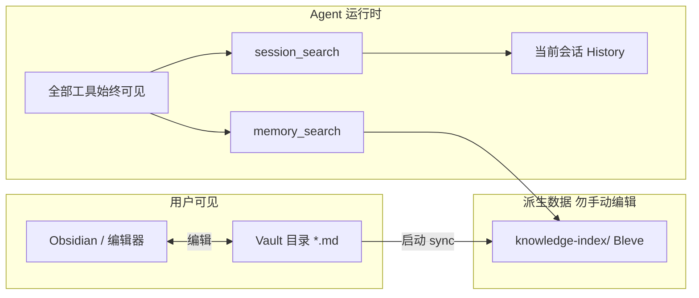

# 知识库（Knowledge Vault）产品说明

OpenOcta **知识库**是一套面向个人与团队的长期知识管理能力：你在本地用 **Obsidian**（或任意 Markdown 编辑器）维护笔记，Agent 在对话中通过检索工具按需引用这些笔记，以及当前会话中的历史内容。

与旧版「隐藏大部分工具、仅暴露检索入口」的 Skylark 渐进模式不同，知识库采用 **Vault + 按需检索** 设计：**Agent 始终拥有完整工具能力**（bash、读写文件、MCP 等不被隐藏），知识通过 `memory_search` 与 `session_search` 两个专用工具拉取。

---

## 一、产品定位

| 维度 | 说明 |
|------|------|
| **是什么** | 基于 Obsidian 兼容 Vault 的可检索知识库，底层为 Bleve 全文索引 + 可选向量语义检索 |
| **给谁用** | 需要把 SOP、架构笔记、运维手册、项目上下文交给 Agent 参考的用户与团队 |
| **怎么用** | 在 Vault 目录写 `.md` 笔记 → Agent 启动时自动建索引 → 对话中调用 `memory_search` / `session_search` |
| **不是什么** | 不是聊天自动摘要库、不是 Agent 私有的 Evolution 记忆、不是 SQLite 嵌入式记忆索引 |

---

## 二、解决什么问题

### 2.1 用户侧痛点

- **知识散落**：Runbook、设计文档、踩坑记录分散在本地文件、IM 和脑子里，Agent 每次对话都要重新解释背景。
- **不可编辑的黑盒**：旧版记忆索引对用户不可见，难以用熟悉的笔记工具维护与版本管理。
- **工具被隐藏**：渐进式检索模式下，模型需要先「解锁」工具，体验不稳定，也不符合「Agent 应能直接执行操作」的预期。

### 2.2 产品目标

1. **用户可见、可编辑**：Vault 就是普通文件夹里的 Markdown，可用 Obsidian 直接打开。
2. **检索准确、按需加载**：长文档分块索引，Agent 用自然语言查询，返回路径、行号与摘要，便于溯源。
3. **工具全量可用**：检索与执行并行——先查知识库，再 bash / 读文件 / 调 MCP，无需额外解锁步骤。
4. **配置极简**：路径与分块参数内置默认值，多数用户零配置即可使用。

---

## 三、核心能力

| 能力 | 说明 |
|------|------|
| **Obsidian 兼容 Vault** | 标准 Markdown 目录结构；支持子文件夹；忽略 `.obsidian/`、`.trash/` 与隐藏路径 |
| **混合检索** | Bleve 全文检索；配置 Embedding API Key 后叠加向量相似度（默认权重：全文 0.55 / 向量 0.45） |
| **会话内历史检索** | `session_search` 在当前会话 History 中查找相关轮次，适合「上次说的…」「继续刚才」类追问 |
| **自动初始化** | 首次启动创建 Vault 目录与 `README.md` 引导；索引目录自动维护，无需手动建库 |
| **可选关闭** | `agents.defaults.knowledge.enabled: false` 可关闭 Vault 同步与 `memory_search` 注册 |

---

## 四、典型使用场景

### 4.1 个人知识助手

在 Vault 中维护「常用命令」「服务器清单」「个人偏好」等笔记。与 Agent 对话时，它会检索 Vault 再回答，减少重复说明。

### 4.2 团队 Runbook / SOP

将运维手册、发布流程、故障处理步骤写入 Vault（可纳入 Git 版本管理）。值班 Agent 通过 `memory_search` 引用最新文档片段，再结合 bash / MCP 执行操作。

### 4.3 项目上下文沉淀

架构决策、API 约定、模块说明以 Markdown 形式放在 `<workspace>/vault/`。项目 Agent 优先检索 workspace Vault，与代码仓库同生命周期管理。

### 4.4 会话内追问

用户说「按刚才的方案继续」时，Agent 可调用 `session_search` 定位当前会话中的相关轮次，而不依赖跨会话的 Vault 笔记。

---

## 五、工作原理



**索引更新时机**：Agent Runtime 启动时扫描 Vault、分块并 **全量 rebuild** 索引（首版策略；Vault 规模较大时可后续优化为增量索引）。

**默认分块与检索参数**（代码内固定，首版不可配置）：

| 参数 | 默认值 |
|------|--------|
| 分块大小 | 2400 字符 |
| 分块重叠 | 2 行 |
| 单次返回条数（top-k） | 8 |
| 混合权重 | 全文 0.55 / 向量 0.45 |

---

## 六、快速开始

### 6.1 默认路径

| 资源 | 位置 |
|------|------|
| **Vault**（你编辑的笔记） | 若配置了 `agents.defaults.workspace`：`<workspace>/vault/`；否则 `~/.openocta/vault/` |
| **索引**（自动生成） | `~/.openocta/knowledge-index/` |

首次启动会自动创建 Vault，并写入 `README.md` 简要说明。

### 6.2 三步上手

1. **找到 Vault 目录**  
   查看 `openocta.json` 中 `agents.defaults.workspace`，在其下打开 `vault/`；或使用 `~/.openocta/vault/`。

2. **写笔记**  
   新建任意 `.md` 文件，例如 `ops/k8s-troubleshoot.md`。支持子目录与 Obsidian 双链语法（索引以纯文本为准）。

3. **重启或新开 Agent 会话**  
   Runtime 启动时会 sync Vault 并 rebuild 索引。之后在对话中 Agent 可通过 `memory_search` 检索这些内容。

### 6.3 用 Obsidian 打开

1. 打开 Obsidian → **Open folder as vault**
2. 选择上述 Vault 目录
3. 像平时一样编辑；保存后，下次 Agent 启动会重新索引

> **注意**：`.obsidian/` 配置目录不会被索引，不影响检索内容。

### 6.4 在 OpenOcta 界面中浏览

顶栏 **知识库** 标签页提供 Obsidian 风格工作台（文档 / 图谱 / 全文搜索 / 同步索引等）。**操作步骤与界面说明**见 **[知识库用户使用手册](./knowledge-vault-user-guide.md)**。

需 Gateway 已连接；Vault 路径与 Agent 运行时一致。

---

## 七、Agent 检索工具

Agent 在需要时主动调用以下工具（也出现在 UI 工具策略的 `group:memory` 分组中）。

### 7.1 `memory_search`

**用途**：在 Vault 知识库中搜索与查询相关的 Markdown 分块。

**典型入参**：

```json
{
  "query": "Kubernetes 节点 NotReady 怎么处理",
  "limit": 8
}
```

**返回要点**：`path`（Vault 内相对路径）、`start_line` / `end_line`、`snippet`、`score`。

**适用**：Runbook、架构文档、长期沉淀的项目知识。

### 7.2 `session_search`

**用途**：在当前会话的对话历史中搜索相关轮次。

**典型入参**：

```json
{
  "query": "上次部署用的镜像 tag",
  "limit": 8
}
```

**适用**：「刚才说的」「继续上一步」等同一会话内的追问。

> **跨会话续聊**：`session_search` 仅检索**当前进程内存中的 History**。若 Gateway 每次请求是新进程，需配置 Session History Loader 将会话记录灌回内存，详见 agentsdk-go [session-history.md](https://github.com/stellarlinkco/agentsdk-go/blob/main/docs/session-history.md)。

---

## 八、配置说明

知识库采用 **最小配置** 原则：路径、分块、top-k 等使用内置默认值，一般无需调整。

### 8.1 启用 / 关闭

```json
{
  "agents": {
    "defaults": {
      "knowledge": {
        "enabled": true
      }
    }
  }
}
```

| 情况 | 行为 |
|------|------|
| 省略 `knowledge` 或 `enabled` | **默认开启** |
| `"enabled": false` | 关闭 Vault sync，不注册 `memory_search`（`session_search` 仍可用） |

### 8.2 Workspace 与 Vault 关系

配置了 `agents.defaults.workspace`（或单个 Agent 的 `workspace`）时，Vault 位于 **该 workspace 下的 `vault/`**，便于与项目代码同仓管理。未配置 workspace 时，Vault 落在状态目录 `~/.openocta/vault/`。

### 8.3 Embedding（可选）

未配置 Embedding API Key 时，**仍可正常使用 Bleve 全文检索**。

配置以下环境变量之一即可启用向量检索（详见 [环境变量说明](./environment-variables.md) 与 agentsdk-go 文档）：

- `OPENAI_API_KEY`
- `SKYLARK_EMBEDDING_API_KEY` / `SKYLARK_EMBEDDING_BASE_URL` / `SKYLARK_EMBEDDING_MODEL`

也可写在 `openocta.json` 的 `env.vars` 中，由 Gateway 注入进程环境。

---

## 九、与其他记忆能力的关系

OpenOcta 存在多种「记忆」相关能力，职责不同，**请勿混淆**：

| 能力 | 存储位置 | 维护者 | 用途 |
|------|----------|--------|------|
| **Knowledge Vault** | `vault/*.md` | **用户**（Obsidian 等） | 长期可编辑知识库，`memory_search` |
| **会话 History** | 内存 + 可选会话持久化 | 运行时 | 多轮对话上下文，`session_search` |
| **Evolution memory** | `.agents/evolution/` | **Agent**（L4 自主进化） | Agent 自主维护的结构化记忆，独立 `memory` 工具 |
| **Skills** | `skills/SKILL.md` | 用户 / 市场 | 领域工作流与提示注入，非 Vault 检索 |

**设计原则**：Vault 是「你写的笔记」；Evolution 是「Agent 自己记的结论」；Skills 是「可复用的能力包」。三者互补，不互相替代。

---

## 十、从旧版迁移

以下配置与能力已在知识库重构中 **移除**，写入 `openocta.json` 时会被忽略，无需手动清理：

| 已移除 | 替代方案 |
|--------|----------|
| `agents.defaults.memorySearch.*`（SQLite FTS 等） | 使用 Vault + `memory_search` |
| `agents.defaults.skylark.*` | 已删除渐进式工具隐藏；改用 Knowledge |
| `OPENOCTA_SKYLARK` 环境变量 | 删除；Knowledge 默认开启 |
| `memory_get` 工具 | 用 `memory_search` 获取片段；原文在 Vault 文件中 |
| `retrieve_knowledge` / `retrieve_capabilities` | 分别由 `memory_search` / 全量工具列表替代 |

**迁移建议**：

1. 将原 `MEMORY.md`、`memory/*.md` 或 SQLite 索引来源的文档 **复制到 Vault 目录**。
2. 删除配置中的 `memorySearch`、`skylark` 字段（可选）。
3. 重启 Gateway / Agent，确认 `~/.openocta/knowledge-index/` 或 workspace 下 Vault 已生成索引。
4. 在 UI **Agents → 工具策略** 中确认 `group:memory` 包含 `memory_search` 与 `session_search`。

---

## 十一、常见问题

### Q1：改了 Vault 里的笔记，Agent 为什么还搜不到？

索引在 **Agent Runtime 启动时** rebuild。编辑笔记后需 **重启 Gateway 或新开一次会触发 Runtime 重建的会话**。首版为全量 rebuild，不支持热更新监听。

### Q2：没有 OpenAI Key 能用吗？

可以。无 Embedding 时仅使用 Bleve 全文检索，对关键词与 BM25 类匹配仍然有效。

### Q3：Vault 可以放到 Git 仓库里吗？

可以。建议将 `vault/` 纳入版本管理；将 `knowledge-index/` 加入 `.gitignore`（索引为派生数据，会在本地自动重建）。

### Q4：Agent 还会隐藏 bash、MCP 等工具吗？

不会。知识库重构后 **所有工具始终对模型可见**。检索工具与执行工具并行使用，不再有「先 retrieve_capabilities 再 unlock」流程。

### Q5：和 UI 里「记忆 / Memory」插件配置是什么关系？

`openocta.json` 顶层的 `memory` 块（如 QMD 等插件型记忆后端）与 **Knowledge Vault 独立**。Knowledge 由 `agents.defaults.knowledge` 控制；若同时使用插件记忆，请分别理解其文档，避免重复索引同一内容。

---

## 十二、限制与后续规划

| 项目 | 当前状态 |
|------|----------|
| 索引策略 | 每次启动 **全量 rebuild**；超大 Vault 可能略慢 |
| 热更新 | 不支持文件 watch；改笔记需重启 Runtime |
| 可配置项 | 分块大小、top-k、权重等 **首版硬编码** |
| 格式支持 | 仅 `.md`；PDF、Word 等不在范围内 |

后续可能引入：增量索引、Vault 变更监听、更多可配置项。以版本发布说明为准。

---

## 十三、相关文档

- **[知识库用户使用手册](./knowledge-vault-user-guide.md)** — 界面操作、快捷键、同步索引、FAQ（**推荐终端用户阅读**）
- [配置说明](./configuration.md) — Gateway 与 Agent 全局配置
- [环境变量说明](./environment-variables.md) — 运行时环境变量
- [工具说明](./tools.md) / [OpenOcta 扩展工具](./tools-openocta.md) — 工具总览
- agentsdk-go [skylark.md / Knowledge API](https://github.com/stellarlinkco/agentsdk-go/blob/main/docs/skylark.md) — 底层 Bleve 引擎与 SDK 选项
